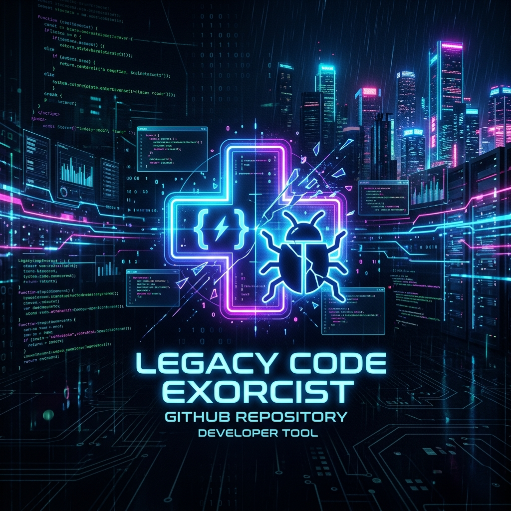

<div align="center">
  
</div>


[English](README.en.md) | [繁體中文](README.md)

# Legacy Code Exorcist

"Code that enters here has only two possible fates: It gets cured, or it gets dissected."

This is a full-ecosystem AI enhancement suite designed for "AI-dependent developers" and "victims of legacy systems." We have repackaged top-tier AI debugging engines into a **"Multi-Persona Digital Forensic System."** Regardless of which AI coding assistant you use, simply importing this project will grant it psychic-level debugging and code-dissection abilities.

## 🌟 Core Highlights (Features)

* **💻 Cross-Agent Plug & Play**: Natively supports Cursor, Copilot, Roo-Code (Cline), Claude Code, and Antigravity.
* **🖼️ Vague Bug Triage (Multimodal)**: Supports reading `ticket.txt` customer complaints and `screenshot.png` error popups. The AI acts as a detective, linking the visual UI elements to the backend code to find the root cause directly.
* **🎵 Opt-in Immersive BGM**: The validation engine comes with a built-in music player! Add the `--audio` flag, and the AI will automatically play its专属 character theme song (e.g., Heavy Metal or Cyberpunk drone) in the background while "thinking", stopping precisely the moment the debugging report is printed.
* **🚀 Lightweight CLI Sandbox**: Built-in, Docker-free native Node.js CLI that supports testing different code "corpses" using local open-source models (LM Studio / Ollama).

---

## 🚀 Quick Start

### 1. Equip your AI IDE with the Forensic Lens
This project has pre-configured files for all major AI editors. Simply copy this project into your workspace, and your AI assistant will automatically read the rules and transform:
- **Cursor**: Automatically reads `.cursorrules`
- **GitHub Copilot**: Automatically reads `.github/copilot-instructions.md`
- **Claude Code**: Automatically reads `CLAUDE.md`
- **Roo-Code (Cline)**: Automatically reads `.roomodes`
- **Antigravity**: Automatically reads `.antigravity/SKILL.md`

Just tell your AI in the chat: `"Adopt the Overbearing-CEO persona and autopsy this code fragment."`

### 2. Launch the CLI Sandbox
This repo comes with a powerful local testing engine, allowing you to quickly experience different personas and broken code scenarios.

First, install the lightweight dependencies:
```bash
npm install
cp .env.example .env  # Enter your OPENAI_API_KEY or local baseURL
```

**Basic Code Dissection Test:**
```bash
npm run test:persona Tsundere-Maid.en bad-case01
```

**Multimodal Vague Debugging + Immersive Audio:**
Ensure you have placed a high-quality audio file with the same name as the persona (e.g., `Tsundere-Maid.en.mp3`) in the `assets/bgm/` directory:
```bash
npm run test:persona Tsundere-Maid.en bad-case02-vague -- --audio
```

---

## 🎭 The Forensic Lineup (Personas)

| Codename | Description | Configuration File |
| :--- | :--- | :--- |
| **Simon (Default Forensic)** | Calm, precise, and ruthless analysis like a surgical scalpel. | `Default-Forensic.en.md` |
| **Caesar (Overbearing CEO)** | Obsessed with efficiency, mildly abusive, extreme performance standards. | `Overbearing-CEO.en.md` |
| **Rina (Tsundere Maid)** | A fast-paced genius hacker who aggressively fixes your bugs while scolding you. | `Tsundere-Maid.en.md` |

*(More forensics are currently being recruited... PRs contributing your unique persona models are welcome)*

---

## 🛡️ License & Code of Conduct
MIT License. Please note: The tone of some forensic personas is highly aggressive and brutally realistic. Please ensure your heart is as strong as your codebase.

<div align="center">
  <i>"May your refactoring be swift, and your latency be zero."</i>
</div>
