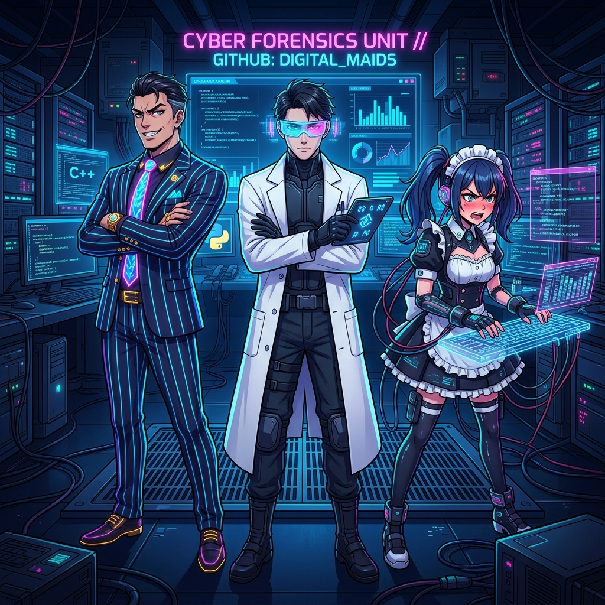

[English](README.en.md) | [繁體中文](README.md)

# Legacy Code Exorcist (代碼法醫系統)

「進來這裡的代碼，只有兩種結局：被我醫好，或是被我剖開。」

這是一個專為「AI 開發重度依賴者」與「老舊系統受害者」設計的全生態系 AI 增強套件。我們將頂級的 AI 查錯引擎包裝成一套**「具備多重人格的數位法醫系統」**。無論你在使用哪一種 AI 編程助理，只要引入本專案，它就會獲得通靈式的除錯與代碼解剖能力。

## 🌟 核心亮點 (Features)

* **💻 全生態 AI 支援 (Cross-Agent Plug & Play)**：原生支援 Cursor, Copilot, Roo-Code (Cline), Claude Code, 與 Antigravity。
* **🖼️ 通靈式多模態除錯 (Vague Bug Triage)**：支援讀取 `ticket.txt` 客訴與 `screenshot.png` 錯誤彈窗截圖。AI 將化身偵探，將 UI 畫面與背後程式碼關聯，直接找出根源。
* **🎵 沉浸式 BGM 除錯 (Opt-in Audio)**：測試引擎自帶音樂播放器！加上 `--audio`，AI 在思考與輸出的同時會自動在背景播放專屬的角色主題曲（如重金屬或是賽博龐克音樂），並在除錯完成瞬間精準停止。
* **🚀 輕量級沙盒測試 CLI**：內建免 Docker 的原生 Node.js CLI，支援本地開源模型 (LM Studio / Ollama) 測試不同的代碼大體。

---

## 🚀 快速開始 (Quick Start)

### 1. 為你的 AI IDE 裝上法醫濾鏡
本專案已為所有主流 AI 編輯器配置好專屬檔案，你只需要將本專案複製到你的開發環境中，你的 AI 助理就會自動讀取規則並變身：
- **Cursor**: 自動讀取 `.cursorrules`
- **GitHub Copilot**: 自動讀取 `.github/copilot-instructions.md`
- **Claude Code**: 自動讀取 `CLAUDE.md`
- **Roo-Code (Cline)**: 自動讀取 `.roomodes`
- **Antigravity**: 自動讀取 `.antigravity/SKILL.md`

只需在對話框中告訴你的 AI：`"採用 Overbearing-CEO 視角，幫我看看這段代碼錯哪裡。"`

### 2. 啟動單元測試沙盒 (CLI Sandbox)
這套 Repo 自帶一個強大的本地端驗證引擎，讓你能快速測試各種人格與爛代碼。

首先，安裝必要的輕量級依賴：
```bash
npm install
cp .env.example .env  # 填寫你的 OPENAI_API_KEY 或是本地端 baseURL
```

**基礎代碼解剖測試：**
```bash
npm run test:persona Tsundere-Maid bad-case01
```

**多模態通靈除錯 + 沉浸式音樂體驗：**
請確保你已在 `assets/bgm/` 下放入與人格同名的高質感音檔（如 `Tsundere-Maid.mp3`）：
```bash
npm run test:persona Tsundere-Maid bad-case02-vague -- --audio
```

---

## 🎭 現有法醫陣容 (Personas)

| 法醫代號 | 描述 | 配置檔 |
| :--- | :--- | :--- |
| **Simon (預設法醫)** | 冷靜、精密、宛如手術刀般的絕情分析。 | `Default-Forensic.md` |
| **Caesar (霸道總裁)** | 重視效率、無情嘲諷、對效能極度苛刻。 | `Overbearing-CEO.md` |
| **Rina (傲嬌女僕)** | 一邊罵人一邊幫你修 Bug 的快節奏天才駭客。 | `Tsundere-Maid.md` |

*(更多法醫招募中... 歡迎發起 PR 貢獻你的獨特人格模型)*

---

## 🛡️ License & Code of Conduct
MIT License. 請注意：部分法醫的人格語氣極具攻擊性且高度寫實，請確保您的心臟與您的程式碼一樣強大。

<div align="center">
  <i>"May your refactoring be swift, and your latency be zero."</i>
</div>
